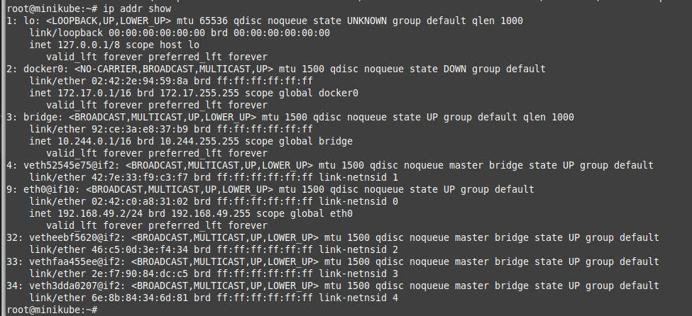

### Тема: Сетевое взаимодействие Pod,взаимодействие Pod, сервисы.

#### План работы

__Работа с тестовым веб-приложением__

- Добавление проверок Pod
- Создание объекта Deployment
- Добавление сервисов в кластер (ClusterIP)\
- Включение режима балансировки IPVS

__Доступ к приложению извне кластер__

- Установка MetalLB в Layer2-режиме
- Добавление сервиса LoadBalancer
- Установка Ingress-контроллера и прокси ingress-nginx
- Создание правил Ingress

#### Добавление проверок Pod

Согласно инструкциям предудущих выполненых заранее развернул миникуб.


Открыл файл с описанием Pod web-pod.yml Добавил в описание пода readinessProbe скопирвал в деректорию и отправил на сервер.


Применяю под.

```
kubectl apply -f web-pod.yml
```


Команда kubectl describe pod/web  проверяю список Conditions:


Проверяю список событий


_По условиям предыдущего ДЗ вебсервер слушает порт 8000 что явилось причиной неготовности контейнера._

Добавил в манифест проверку состояния веб-сервера.


Отправил и запустил под с новой конфигурацией и проверил.


__Вопрос для самопроверки:__

1. Почему следующая конфигурация валидна, но не имеет смысла?
из самого нахождения самого grep всегда возвращается 0.


Проваливаюсь в миникуб и выполняю команды.
```
minikube ssh
ps aux | grep my_web_server_process
echo $?
```


2. Бывают ли ситуации, когда она все-таки имеет смысл?
Имеет смысл, проводится простая проверка - запущен ли процесс или нет
```
ps aux | grep my_web_server_process | grep -v grep
```


информацией ознакомился тут.

 https://kubernetes.io/docs/concepts/workloads/pods/pod-lifecycle/#container-probes


#### Создание Deployment

_Скорее всего, в процессе изменения конфигурации Pod, вы столкнулись с  неудобством  обновления  конфигурации  пода  через kubectl  (и  уже нашли ключик --force). В  любом  случае,  для  управления  несколькими  однотипными  подамитакой способ не очень подходит. Создадим Deployment, который упростит обновление конфигурации пода и управление группами подов._

Создаю файл web-deploy.yaml в папке kubernetes-networks с содержимым и отправляю на сервер. 

удаляю старый под и деплою новый проверяю что получилось
```
kubectl delete pod/web --grace-period=0 --force
kubectl apply -f web-deploy.yaml
kubectl describe deployment web
```
В результате:


Согласно исправлению ReadinessProbe на
- Увеличение число реплик до 3 (replicas: 3)
- Исправления порта в readinessProbe на порт 8000

применяю манифест:


#### Deployment | Самостоятельная работа

Проверяю состояние


Добавляю в манифест (web-deploy.yaml) блок strategy


Попробуем разные варианты деплоя с крайними значениями maxSurge и maxUnavailable (оба 0, оба 100%, 0 и 100%)

- оба 0


- оба 100%


- maxUnavailable: 0 maxSurge: 100%


#### Создание Service | ClusterIP
Cоздаю манифест для сервиса в папке kubernetes-networks файл web-svc-cip.yaml с содержимым отправляю на сервер и применяю.
Подключаюсь к ВМ и проверяю.  

```
kubectl get services
minikube ssh
sudo -i
curl http://10.108.146.102/index.html
iptables --list -nv -t nat | grep 10.108.146.102
ip addr show
```




https://msazure.club/kubernetes-services-and-iptables/

#### Включение IPVS

Включаю IPVS 

При запуске нового инстанса Minikube лучше использовать ключ --extra-config и сразу указать, что мы хотим IPVS

В моём случае так как я исспользую облако где развернул инфаструктуру я буду использовать следующий вид команды.

```
kubectl proxy --address='0.0.0.0' --disable-filter=true
```
теперь перехожу по ссылке.


http://51.250.65.100:8001/api/v1/namespaces/kubernetes-dashboard/services/http:kubernetes-dashboard:/proxy/#/deployment?namespace=default


и соответственно попадаю на сам дашборт.


выбираю namespace kube-system , Configs and Storage/Config Maps и добавляю параметры


Ну и другой способ выполняю команду.

```
kubectl edit configmap -n kube-system kube-proxy
```


Теперь удалим Pod с kube-proxy , чтобы применить новую конфигурацию (он входит в DaemonSet и будет запущен автоматически)

```
kubectl --namespace kube-system delete pod --selector='k8s-app=kube-proxy'
```


Что-то поменялось, но старые цепочки на месте (хотя у них теперь 0 references) 😕 kube-proxy настроил все по-новому, но не удалил мусор Запуск kube-proxy --cleanup в нужном поде - тоже не помогает
```
kubectl --namespace kube-system exec kube-proxy-<POD> kube-proxy --cleanup
```
Полностью очищаю все правила iptables.
Создадаю в ВМ с Minikube файл /tmp/iptables.cleanup


Теперь жду (примерно 30 секунд), пока kube-proxy восстановит правила для сервисов

iptables --list -nv -t nat


Теперь лишние правила удалены и видны только актуальную конфигурацию.


### Работа с LoadBalancer и IngressIngress

#### Установка MetalLB

MetalLB  позволяет  запустить  внутри  кластера  L4-балансировщик,который  будет  принимать  извне  запросы  к  сервисам  и  раскидывать  ихмежду подами.
НЕТ все как показал результат все не так просто.


Что то не так.


